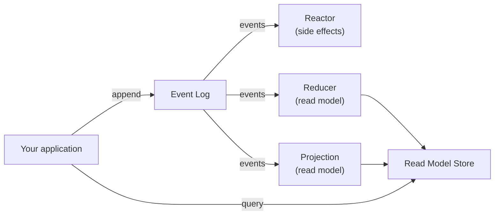

# Concepts

Chronicle is an event-sourced system kernel. The Kotlin client gives you idiomatic access to its core abstractions. Understanding these four concepts is enough to use the full API:

| Concept | What it is |
|---|---|
| **Event** | An immutable fact that something happened in your domain |
| **Event Source** | The entity (identified by a string key) whose history a sequence of events describes |
| **Observer** | Something that reacts to events — either to perform side effects (reactor) or build state (reducer / projection) |
| **Read Model** | A view of state derived from one or more event sources, optimized for querying |

## The flow

Events flow into the event log, which fans them out to all registered observers. Reactors perform side effects; reducers and projections build read models that your application queries later.

## Pages in this section

- [Events](events.md) — what events are, how they are identified, and how generations work
- [Observers](observers.md) — how reactors and reducers observe the event stream
- [Read Models](read-models.md) — how reducers, projections, and queries work together
