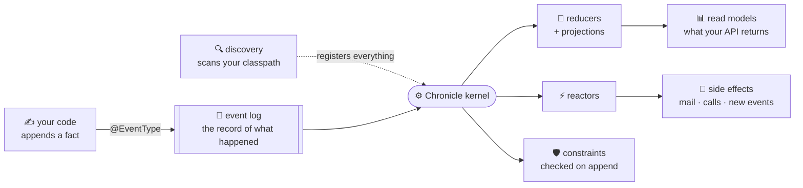

<div align="center">

# 📜 Chronicle for the JVM

**Event sourcing for Kotlin and Java — write the facts, annotate them, and the rest of the system builds itself.**

[](https://discord.gg/kt4AMpV8WV)
[](https://central.sonatype.com/artifact/io.cratis/chronicle)
[](https://github.com/Cratis/Chronicle.Kotlin/actions/workflows/build.yml)
[](https://github.com/Cratis/Chronicle.Kotlin/actions/workflows/publish.yml)
[](LICENSE)

</div>

---

A chronicle is a record of what happened, in the order it happened — kept so that the story can be
told again, from the beginning, to anyone who asks. [Cratis
Chronicle](https://github.com/Cratis/Chronicle) is that idea as a database: your application appends
facts, and every view of the world is derived from them rather than overwritten on top of them.

This repository is the **JVM client** for it. One artifact, `io.cratis:chronicle`, idiomatic from
both **Kotlin** and **Java**, plus a **Spring Boot starter** that reduces setup to a dependency.

Behind it sits a conviction: almost any system that deals with information and business flows is
better told this way — and telling it should feel like writing ordinary Kotlin or Java, familiar
even if you have never event-sourced before. The whole Cratis ecosystem is designed around that:
deliberately simple, light on ceremony, built with productivity, quality, and reliability in mind —
and AI-friendly by design, with free [AI skills](https://github.com/Cratis/AI) for building with it.

## ✨ Why you might want this

- **You declare facts, not plumbing.** An event is a data class or a record with `@EventType` on it.
  A read model is a class with `@ReadModel`. There is no schema file, no registry, no builder to
  keep in sync.
- **Everything registers itself.** Every artifact on your classpath is found and registered with the
  kernel the moment you connect — in the order the kernel needs them. Manual registration is still
  there when you want it, one call away.
- **The past is never lost.** Nothing is updated in place. Every state your system has ever been in
  is reconstructible, which turns "how did this record end up like that?" from an archaeology
  project into a query.
- **Coroutines all the way down.** Every call that touches the kernel suspends. Java gets blocking
  bridges for the same surface, so neither language is the second-class one.
- **Rules the kernel enforces.** Uniqueness and other constraints are checked at append time, on the
  server, not by a read-then-write race in your code.

## 📜 What a slice looks like

Four annotated types, and you have an event-sourced feature — the fact, the state it produces, the
fold that produces it, and the rule that guards it:

<table>
<tr><th width="50%">Kotlin</th><th width="50%">Java</th></tr>
<tr valign="top"><td>

```kotlin
@EventType
data class EmployeeHired(
    val firstName: String = "",
    val lastName: String = "",
    val title: String = ""
)

@EventType
data class EmployeePromoted(val newTitle: String = "")

@ReadModel
data class EmployeeState(
    val id: String = "",
    val firstName: String = "",
    val title: String = ""
)

@Reducer
class EmployeeStateReducer {
    fun employeeHired(event: EmployeeHired) =
        EmployeeState(
            firstName = event.firstName,
            title = event.title)

    fun employeePromoted(
        event: EmployeePromoted,
        state: EmployeeState?
    ) = (state ?: EmployeeState())
        .copy(title = event.newTitle)
}
```

</td><td>

```java
@EventType
public record EmployeeHired(
    String firstName,
    String lastName,
    String title
) {}

@EventType
public record EmployeePromoted(String newTitle) {}

@ReadModel
public class EmployeeState {
    private String id = "";
    private String firstName = "";
    private String title = "";
    // getters and setters
}

@Reducer
public class EmployeeStateReducer {
    public EmployeeState employeeHired(
            EmployeeHired event) {
        return new EmployeeState("",
            event.firstName(), event.title());
    }

    public EmployeeState employeePromoted(
            EmployeePromoted event,
            EmployeeState state) {
        var current = state != null
            ? state : new EmployeeState();
        current.setTitle(event.newTitle());
        return current;
    }
}
```

</td></tr>
</table>

No registration code appears anywhere above, and none is needed. Append an event and the read model
is there:

```kotlin
store.eventLog.append("employee-1", EmployeeHired("Ada", "Lovelace", "Engineer"))
val ada = store.readModels.getInstanceByKey(EmployeeState::class, "employee-1")
```

## 🧩 The cast

Everything you write is one of a handful of kinds. Annotate it, and the client finds it:

| Artifact | You write | It does |
| --- | --- | --- |
| **Event type** | `@EventType` on a data class or record | Records a fact that happened. Immutable, forever |
| **Read model** | `@ReadModel` on a class | The shape some part of your system reads |
| **Reducer** | `@Reducer` with one method per event | Folds a stream of events into a read model |
| **Projection** | `IProjectionFor<T>`, or `@FromEvent` on the model | Declares the same fold, without writing the fold |
| **Reactor** | `@Reactor` with one method per event | Does something when a fact arrives — mail, calls, more events |
| **Constraint** | `IConstraint` with `@Constraint` | A rule the kernel enforces before an append is accepted |
| **Seeder** | `ICanSeedEvents` with `@Seeder` | Facts that should exist the first time the system runs |
| **Migration** | `IEventTypeMigration<New, Old>` | Carries an event type forward to a new generation |
| **Webhook** | `IWebhookDefiner` | Pushes events out to something beyond your process |

## 🎥 How it fits together



The one arrow worth pointing at is the dotted one. You never build that list — the client does, on
every connect, so a kernel that restarts is told everything again without you noticing.

## 🚀 Quick start

You need a kernel. The development image is a single command:

```shell
docker run -p 35000:35000 cratis/chronicle:latest-development
```

### Plain Kotlin or Java

```kotlin
// build.gradle.kts
dependencies {
    implementation("io.cratis:chronicle:2.1.1")
}
```

```groovy
// build.gradle
dependencies {
    implementation 'io.cratis:chronicle:2.1.1'
}
```

Connect, wait for the first registration pass, and go:

<table>
<tr><th width="50%">Kotlin</th><th width="50%">Java</th></tr>
<tr valign="top"><td>

```kotlin
fun main() = runBlocking {
    val client = ChronicleClient(
        ChronicleOptions.development())
    val store = client.getEventStore("MyApp")
    store.awaitRegistration()

    store.eventLog.append(
        "employee-1",
        EmployeeHired("Ada", "Lovelace", "Engineer"))

    val ada = store.readModels
        .getInstanceByKey(
            EmployeeState::class, "employee-1")
    println(ada)

    client.dispose()
}
```

</td><td>

```java
public static void main(String[] args) {
    var client = new ChronicleClient(
        ChronicleOptions.Companion.development());
    var store = client.getEventStore(
        "MyApp", "Default");
    EventStoreJavaBridge.awaitRegistration(store);

    EventLogJavaBridge.append(
        store.getEventLog(), "employee-1",
        new EmployeeHired(
            "Ada", "Lovelace", "Engineer"), null);

    var ada = ReadModelsJavaBridge
        .getInstanceByKey(store.getReadModels(),
            EmployeeState.class, "employee-1");
    System.out.println(ada);

    client.dispose();
}
```

</td></tr>
</table>

Java cannot call Kotlin `suspend` functions, so the client ships a blocking bridge per service in
`io.cratis.chronicle.java` — same surface, no coroutines required.

### Spring Boot

The starter brings the client with it and wires everything up:

```kotlin
// build.gradle.kts
dependencies {
    implementation("io.cratis:chronicle-spring-boot-starter:2.1.1")
}
```

```yaml
cratis:
  chronicle:
    event-store: Ordering
```

That is the whole setup. Your artifacts are discovered in your application's packages and registered
before the first request is served, and an `IEventStore` is ready to inject:

<table>
<tr><th width="50%">Kotlin</th><th width="50%">Java</th></tr>
<tr valign="top"><td>

```kotlin
@RestController
class Employees(
    private val eventStore: IEventStore
) {
    @PostMapping("/employees/{id}/hire")
    fun hire(
        @PathVariable id: String,
        @RequestBody hire: Hire
    ) = runBlocking {
        eventStore.eventLog.append(id,
            EmployeeHired(
                hire.firstName,
                hire.lastName,
                hire.title))
    }
}
```

</td><td>

```java
@RestController
public class Employees {
    private final Chronicle chronicle;

    public Employees(Chronicle chronicle) {
        this.chronicle = chronicle;
    }

    @PostMapping("/employees/{id}/hire")
    public void hire(
            @PathVariable String id,
            @RequestBody Hire hire) {
        chronicle.append(id,
            new EmployeeHired(
                hire.firstName(),
                hire.lastName(),
                hire.title()));
    }
}
```

</td></tr>
</table>

Artifacts are activated through the Spring container, so a reactor takes its dependencies through
its constructor like any `@Service`. On top of that the starter gives every request an identity, a
causation trail, and a unit of work — and can route each one to its own tenant namespace from a
header, a subdomain, or a claim. See the [Spring Boot guide](Documentation/guides/spring-boot.md).

## 🌍 Facts with a place

A fact often happened *somewhere*. `Point`, `LineString` and `Polygon` are ordinary properties on an
event, read model or reducer state, and they serialize as GeoJSON — which is how the kernel
recognizes the value as geospatial and how the sink knows to index and query it:

<table>
<tr><th width="50%">Kotlin</th><th width="50%">Java</th></tr>
<tr valign="top"><td>

```kotlin
@EventType
data class WarehouseInspected(
    val warehouseId: String = "",
    val inspectedAt: Point = Point(0.0, 0.0)
)

store.eventLog.append(
    "warehouse-1",
    WarehouseInspected("warehouse-1", Point(10.75, 59.91)))
```

</td><td>

```java
@EventType
public record WarehouseInspected(
    String warehouseId,
    Point inspectedAt
) {}

store.getEventLog().append(
    "warehouse-1",
    new WarehouseInspected(
        "warehouse-1", new Point(10.75, 59.91)));
```

</td></tr>
</table>

On the wire that becomes the shape the kernel looks for, with no mapping of your own:

```json
{ "warehouseId": "warehouse-1", "inspectedAt": { "type": "Point", "coordinates": [10.75, 59.91] } }
```

See [Geospatial types](Documentation/reference/geospatial.md) for the full reference, including
polygons with holes.

## 🧰 What's in this repo

| Piece | What it is | Where |
| --- | --- | --- |
| **`io.cratis:chronicle`** | The JVM client — annotations, coroutines, artifact discovery, Java bridges | [`Source`](Source) |
| **`io.cratis:chronicle-spring-boot-starter`** | Spring Boot auto-configuration, multi-tenancy, per-request identity and units of work | [`Integrations/SpringBoot`](Integrations/SpringBoot) |
| **`io.cratis:chronicle-testing`** | In-process scenarios for specifying a slice with no kernel, container or database | [`Testing`](Testing) |
| **Kotlin console sample** | An interactive tour of the whole API, with registration done by hand | [`Samples/Kotlin/Console`](Samples/Kotlin/Console) |
| **Java console sample** | The same tour in Java | [`Samples/Java/Console`](Samples/Java/Console) |
| **Kotlin Spring Boot sample** | An event-sourced HTTP API with no setup code at all | [`Samples/Kotlin/SpringBoot`](Samples/Kotlin/SpringBoot) |
| **Java Spring Boot sample** | The same application in Java | [`Samples/Java/SpringBoot`](Samples/Java/SpringBoot) |
| **Documentation** | Getting started, guides, and the API reference | [`Documentation`](Documentation) |

## 🗺️ Start here

- [Get Started](Documentation/get-started/index.md) — install, connect, append, and read a read model
  back, in Kotlin and Java. **Start here.**
- [Artifact Registration](Documentation/guides/artifact-registration.md) — what gets discovered, in
  what order, and how to narrow, replace or turn it off.
- [Spring Boot](Documentation/guides/spring-boot.md) — the starter, multi-tenancy, and per-request
  identity, causation and units of work.
- [Reference](Documentation/reference/index.md) — every annotation, the `IEventStore` API, and the
  full configuration surface.
- [Cratis Chronicle](https://github.com/Cratis/Chronicle) — the kernel this client talks to, and the
  concepts behind it.

## ▶️ Running the samples

```shell
docker run -p 35000:35000 cratis/chronicle:latest-development

gradle :Samples:Kotlin:Console:run          # interactive tour, Kotlin
gradle :Samples:Java:Console:run            # interactive tour, Java
gradle :Samples:Kotlin:SpringBoot:bootRun   # HTTP API on :8080
gradle :Samples:Java:SpringBoot:bootRun     # HTTP API on :8081
```

## ✅ Quality gates

```shell
gradle build                                # every module builds clean
gradle test                                 # all specs pass

cd Documentation && ./verify-markdown.sh    # docs lint + every link resolves
python3 Documentation/validate-client-snippets.py   # every doc snippet compiles
```

Documentation snippets are not decorative — every Kotlin and Java fence in `Documentation/` is
compiled against the real client on every build, so an example that references an API that no longer
exists fails CI rather than a reader.

## 🧩 The Cratis ecosystem

This project is part of [Cratis](https://www.cratis.io) — free, MIT-licensed tools for building
event-sourced and CQRS applications.

- **[Chronicle](https://github.com/Cratis/Chronicle)** — event-sourcing database and runtime. Orleans-based kernel, pluggable storage (MongoDB default; PostgreSQL, SQL Server, SQLite, in-memory), language-agnostic gRPC contracts. [Docs](https://www.cratis.io/chronicle/)
- **Chronicle clients** — first-class [.NET SDK](https://github.com/Cratis/Chronicle), plus [TypeScript](https://github.com/Cratis/Chronicle.TypeScript), Kotlin/Java (this repository), and [Elixir](https://github.com/Cratis/Chronicle.Elixir); [Python](https://github.com/Cratis/Chronicle.Python) coming soon (pre-alpha). AI agents connect through the [Chronicle MCP server](https://github.com/Cratis/Chronicle.Mcp).
- **[Arc](https://github.com/Cratis/Arc)** — opinionated CQRS framework for ASP.NET Core with commands, queries, validation, authorization, and TypeScript proxy generation. Works without event sourcing. [Docs](https://www.cratis.io/arc/)
- **[Components](https://github.com/Cratis/Components)** — React components aligned with Arc patterns. [Docs](https://www.cratis.io/components/)
- **[CLI](https://github.com/Cratis/cli) + Workbench** — inspect and diagnose Chronicle from the terminal or the browser. [Docs](https://www.cratis.io/cli/)
- **Model-first layer (experimental)** — Studio, [Screenplay](https://github.com/Cratis/Screenplay), [Stage](https://github.com/Cratis/Stage), [Scene](https://github.com/Cratis/Scene), [Prologue](https://github.com/Cratis/Prologue)
- **Supporting** — [Fundamentals](https://github.com/Cratis/Fundamentals), [Specifications](https://github.com/Cratis/Specifications), [Synopsis](https://github.com/Cratis/Synopsis), [Lens](https://github.com/Cratis/Lens), [Narrator](https://github.com/Cratis/Narrator), and free [AI tooling](https://github.com/Cratis/AI) (preview); Ensemble coming soon (pre-release)
- **[Samples](https://github.com/Cratis/Samples)** — runnable event sourcing and CQRS samples for the whole stack

Everything Cratis publishes today is MIT licensed and free to use.

---

<div align="center">

*Part of the [Cratis](https://cratis.io) platform · Licensed under the [MIT license](LICENSE)*

</div>
